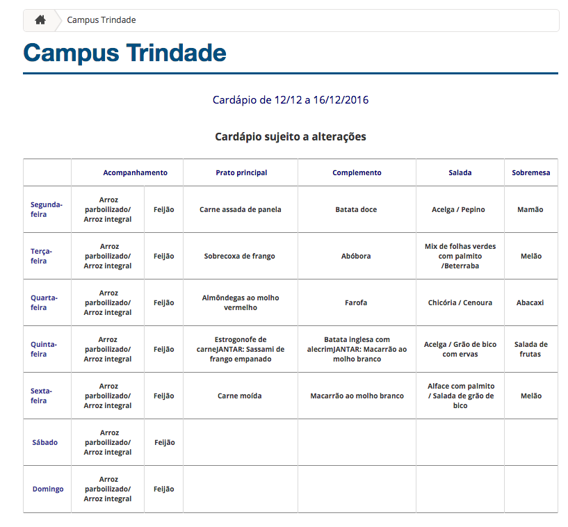
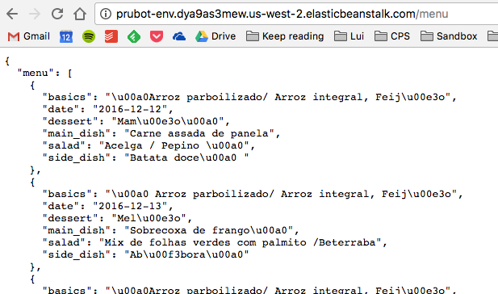

# Messenger bot, what’s in the menu today?
We’ve been curious to implement a chat bot for some time. For this first gig, we gave Facebook Messenger a chance to have some fun with.

So, we started asking ourselves: what could be a useful application for that? Turns out we found that getting to know our uni’s restaurant menu in advance sounded nice.

To start with, we decided to implement a chat bot that sends the daily menu.  That was our mission until the end of the gig. 

We started defining the systems functions:

1. Scrape uni’s restaurant menu from official website and make it available through an API;
2. Request data from bot server;
3. Send scheduled messages to students just before noon.

Our implementation is described next.

## Scraping the restaurant page with Python and serving with Flask
The webpage looks like this:



As you can see, it is a boring, dull menu table that makes student life really (REALLY.) hard and unsatisfying.

To get the data, we chose Python and its modules `request` and `BeautifulSoup`. Besides extracting the from the menu table we needed to get the menu’s date from the top page title. Below are some excerpts of the scraping code:

```
from bs4 import BeautifulSoup
import requests

url = 'http://ru.ufsc.br/ru/'
r = requests.get(url)
soup = BeautifulSoup(r.text, "html.parser")  # Makes usable 'soup' from page HTML

text = soup.find('p').text  # Title with date is the page's first paragraph 
#(...)
table = soup.find('tbody')  # Table contents
#(...)
```
To extract the date from text, we used some regex searches with Python’s module `re` and then formatted it with `datetime` module.   

To parse the table, we first iterated over all **td** tags inside **tbody** and appended all items to a list. Then, we organized the list’s content into an array of dictionaries grouping the data for each day of the week. 

Having the data extracted, we needed to make it available for the bot to request it. That’s when Flask came into to play. We elegantly implemented a simple REST API that returns a JSON object with the weekly menu:
```
from flask import Flask, jsonify
import scraping  # Our own script shown above

# EB looks for an 'application' callable by default.
application = Flask(__name__)

@application.route('/')
def hello_world():
    return 'hello world! pru pru'

@application.route('/menu', methods=['GET'])
def get_tasks():
    return jsonify(scraping.get_menu())

# run the app.
if __name__ == "__main__":
    application.run()
```

With this code up and running locally, we proceeded to deploy it to the cloud using Amazon AWS. We followed [this tutorial](http://docs.aws.amazon.com/elasticbeanstalk/latest/dg/create-deploy-python-flask.html) - and thanked [this issue](http://stackoverflow.com/questions/20558747/how-to-deploy-structured-flask-app-on-aws-elastic-beanstalk) - to make it work. Also, we learned the hard way **you must commit and push your changes** before each Elastic Beanstalk deployment (even if it doesn't make much sense, since GH and EB don't have any explicit relation). Otherwise it might fail and steal more or less 3 hours of your life (if you’re lucky).

So yep, once AWS EB finished setting up the instance we finished this part. This is how we delivered the scraping result:



Next, let’s take a look in the real fun: **The Robot**.

## Creating a talkative Facebook Messenger bot
It was hard. But we made it work.


